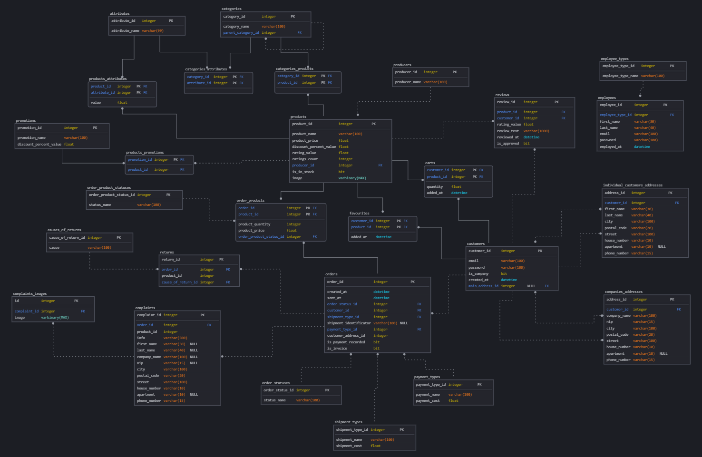

# Shopberry (Backend)
This project is an e-commerce website that allows customers to browse products, manage their accounts, place orders, and track their purchase history.  
Employees handle order processing, returns, and customer complaints.  
Administrators manage products, categories, users, and reviews, while also configuring discounts and store settings.  
The store owner has full access to financial statistics, sales data, and overall business performance.  
The platform ensures a seamless shopping experience with efficient management tools for all roles.

 
 
 

# Application Functionalities:
## Customer Website Features:
1. Account:
   * Creating a new account (registration)
   * Logging into an account
   * Resetting the password
   * Managing account details (email, first name, last name, password, etc.)
2. Browsing the store:
   * Displaying the product list (one below the other)
   * Viewing products by category
   * Filtering the product list
   * Sorting the product list
3. Wishlist:
   * Adding products to the wishlist
   * Removing products from the wishlist
4. Orders & Shopping:
   * Adding products to the cartEntry
   * Removing products from the cartEntry
   * Modifying the quantity of products in the cartEntry
   * Finalizing an order from the cartEntry
   * Adding coupons/promotion codes
   * Viewing order history

 

## Employee Website Features:
1. Order Management:
   * Viewing the list of orders
   * Changing the order status (e.g., "Processing," "Shipped," "Completed," "Canceled")
   * Viewing order details (customer, products, delivery address, payment method)
2. Handling Complaints & Returns:
   * Viewing customer complaints and return requests
   * Changing the complaint/return status
   * Contacting the customer regarding the return

 

## Administrator Website Features:
1. Managing Products & Categories:
   * Adding new products
   * Editing products (changing name, price, description, images, availability)
   * Deleting products
   * Adding new categories
   * Editing categories (changing name, filter attributes)
   * Deleting categories
2. Managing Users:
   * Viewing the user list
   * Deleting user accounts
   * Changing user account types
   * Activating/Deactivating user accounts
3. Managing Reviews & Ratings:
   * Viewing customer reviews
   * Approving or removing inappropriate reviews
4. Managing Discounts & Coupons:
   * Creating discount codes and promotions
5. Store Configuration:
   * Setting up payment methods
   * Configuring shipping costs and delivery methods

 

## Owner Website Features:
1. Financial Management:
   * Viewing sales statistics
   * Monitoring revenue and expenses
2. Viewing Store Data:
   * Checking stock levels and supply status
   * Viewing the number of users

 
 
 

# Technologies:
* Frontend: ReactJS, CSS (SCSS, BootStrap)
* Backend: Java (Spring Boot)
* Database: MSSQL
* APIs: InPost Points, (...to be added)

 
 
 

# Database schema:

